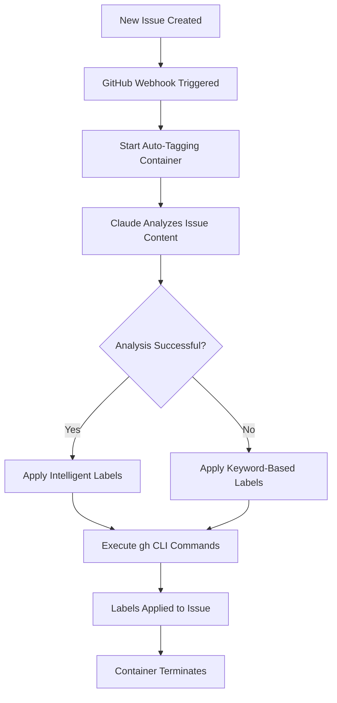

# Auto-Tagging System

Claude Hub automatically analyzes new GitHub issues and applies appropriate labels based on content analysis. This feature helps organize repositories and prioritize work without manual intervention.

## Overview

The auto-tagging system:
- **Triggers** on new issue creation (`issues.opened` webhook)
- **Analyzes** issue title, body, and metadata
- **Applies** relevant labels automatically
- **Operates** silently without posting comments
- **Uses** minimal permissions for security

## Security Architecture

The auto-tagging feature uses a restricted security model:

### Minimal Tool Access
- **Allowed Tools**: `Read`, `GitHub` only
- **No File Editing**: Cannot modify repository files
- **No Bash Access**: Cannot execute system commands
- **No Dangerous Operations**: Restricted to safe operations only

### Dedicated Container
Auto-tagging runs in a specialized container with:
- **Restricted entrypoint**: `claudecode-tagging-entrypoint.sh`
- **Limited capabilities**: Only what's needed for GitHub analysis
- **Tool allowlist**: `--allowedTools Read,GitHub`
- **No permission skipping**: Uses proper permission validation

### CLI-Based Operations
Uses GitHub CLI commands directly:
```bash
gh issue edit --add-label "bug,high-priority" --repo owner/repo 123
```

Benefits:
- **More reliable** than JSON parsing
- **Better error handling**
- **Follows GitHub best practices**
- **Easier to audit and debug**

## Label Categories

### Priority Labels
- **`critical`** - Security vulnerabilities, data loss, system down
- **`high`** - Major features broken, significant user impact
- **`medium`** - Important but not urgent, planned work
- **`low`** - Nice to have, minor improvements

### Type Labels
- **`bug`** - Something isn't working correctly
- **`feature`** - New functionality or enhancement request
- **`enhancement`** - Improvement to existing functionality
- **`documentation`** - Documentation updates or clarifications
- **`question`** - General questions or help requests
- **`security`** - Security-related issues or vulnerabilities

### Complexity Labels
- **`trivial`** - Simple fix, 1-2 lines of code
- **`simple`** - Straightforward implementation, < 1 day
- **`moderate`** - Requires planning, 1-3 days
- **`complex`** - Major undertaking, > 3 days or cross-team effort

### Component Labels
- **`api`** - Backend API endpoints and logic
- **`frontend`** - User interface and client-side code
- **`backend`** - Server-side logic and services
- **`database`** - Database schema, queries, migrations
- **`auth`** - Authentication and authorization
- **`webhook`** - Webhook handling and GitHub integration
- **`docker`** - Container configuration and deployment

## Analysis Process

### 1. Content Analysis
Claude analyzes:
- **Issue title** - Primary intent and topic
- **Issue body** - Detailed requirements and context
- **Code snippets** - Technical complexity indicators
- **Error messages** - Bug identification and severity
- **User mentions** - Stakeholder involvement level

### 2. Intelligent Classification

#### Priority Assessment
```
Critical: "production down", "security vulnerability", "data loss"
High: "blocks development", "user can't login", "major feature broken"
Medium: "improvement needed", "feature request", "optimization"
Low: "nice to have", "minor enhancement", "documentation"
```

#### Type Detection
```
Bug: Error messages, "doesn't work", "crashes", "fails"
Feature: "add support for", "implement", "new functionality"
Enhancement: "improve", "optimize", "better", "faster"
Security: "vulnerability", "exploit", "authentication", "permissions"
```

#### Complexity Estimation
Based on:
- **Scope of changes** described
- **Number of components** affected
- **Technical complexity** indicators
- **Dependencies** mentioned

### 3. Fallback Mechanism

If Claude-based analysis fails, the system falls back to keyword-based labeling:

```javascript
const keywordMapping = {
  'bug': ['error', 'crash', 'fail', 'broken', 'issue', 'problem'],
  'feature': ['add', 'implement', 'support', 'new', 'create'],
  'enhancement': ['improve', 'optimize', 'better', 'enhance', 'upgrade'],
  'documentation': ['docs', 'readme', 'documentation', 'guide', 'help'],
  'security': ['security', 'vulnerability', 'auth', 'permissions', 'exploit']
};
```

## Workflow



## Configuration

### Environment Variables

```bash
# Enable auto-tagging (default: enabled)
AUTO_TAGGING_ENABLED=true

# Maximum labels to apply per issue (default: 5)
AUTO_TAGGING_MAX_LABELS=5

# Confidence threshold for label application (0.0-1.0)
AUTO_TAGGING_CONFIDENCE_THRESHOLD=0.7
```

### Label Setup

Ensure your repository has the required labels. Use the label setup script:

```bash
GITHUB_TOKEN=your_token node scripts/utils/setup-repository-labels.js owner/repo
```

This creates all standard labels with appropriate colors and descriptions.

## Customization

### Custom Label Categories

You can extend the system with repository-specific labels by modifying the label configuration:

```javascript
// Add to your repository-specific config
const customLabels = {
  'mobile': ['ios', 'android', 'mobile', 'app'],
  'performance': ['slow', 'performance', 'optimization', 'speed'],
  'ui/ux': ['design', 'interface', 'user experience', 'layout']
};
```

### Business Logic Rules

Customize auto-tagging logic for your domain:

```javascript
// Example: Always tag issues from specific users as high priority
if (issue.user.login === 'customer-success-team') {
  labels.push('high-priority', 'customer-request');
}

// Example: Auto-assign security label for certain keywords
if (issue.title.includes('CVE-') || issue.body.includes('vulnerability')) {
  labels.push('security', 'critical');
}
```

## Monitoring and Analytics

### Logging

Auto-tagging operations are logged with structured data:

```json
{
  "event": "auto_tagging_completed",
  "issue": 123,
  "repository": "owner/repo",
  "labels_applied": ["bug", "backend", "medium"],
  "analysis_method": "claude",
  "confidence_scores": {
    "bug": 0.95,
    "backend": 0.87,
    "medium": 0.73
  },
  "processing_time_ms": 2340
}
```

### Metrics

Track auto-tagging effectiveness:

- **Accuracy**: How often applied labels are kept vs. removed
- **Coverage**: Percentage of issues that receive auto-tags
- **Performance**: Average processing time per issue
- **Confidence**: Distribution of confidence scores

### Quality Assurance

Monitor for:
- **Over-tagging**: Too many labels applied
- **Under-tagging**: Issues without sufficient labels
- **Mis-classification**: Wrong label types applied
- **Bias**: Systematic misclassification patterns

## Troubleshooting

### Common Issues

#### 1. No Labels Applied
```
Issue created but no labels were added
```

**Check**:
- Auto-tagging is enabled
- Repository has required labels
- GitHub token has write permissions
- Container logs for errors

#### 2. Wrong Labels Applied
```
Issue tagged as 'bug' but it's a feature request
```

**Solutions**:
- Review issue content for clarity
- Adjust confidence thresholds
- Add custom keywords for your domain
- Report patterns for model improvement

#### 3. Permission Errors
```
Error: Cannot edit issue labels
```

**Check**:
- GitHub token has `repo` scope
- Bot has write access to repository
- Repository is not archived
- Issue is not locked

### Debug Mode

Enable detailed logging for troubleshooting:

```bash
LOG_LEVEL=debug
AUTO_TAGGING_DEBUG=true
```

This provides:
- Full issue content analysis
- Confidence scores for each label
- Decision reasoning
- API call details

### Testing

Test auto-tagging with sample issues:

```bash
# Create test issue
gh issue create --title "Bug: Login fails with 500 error" \
  --body "When users try to login, the server returns a 500 error. This affects all users." \
  --repo your-org/your-repo

# Monitor logs for auto-tagging activity
docker logs claude-hub-webhook -f
```

Expected labels: `bug`, `backend`, `high`, `auth`

## Best Practices

1. **Label Consistency**: Use standardized label names across repositories
2. **Regular Review**: Periodically review auto-applied labels for accuracy
3. **Team Training**: Educate team on label meanings and usage
4. **Feedback Loop**: Track which auto-labels are modified manually
5. **Custom Rules**: Implement domain-specific tagging logic
6. **Performance Monitoring**: Watch for processing time increases
7. **Quality Metrics**: Measure and improve tagging accuracy

## Future Enhancements

Planned improvements:
- **Learning from corrections**: Adapt based on manual label changes
- **Multi-language support**: Better analysis of non-English issues
- **Custom training**: Repository-specific model fine-tuning
- **Integration feedback**: Learn from issue resolution outcomes
- **Bulk re-tagging**: Apply improved models to historical issues

The auto-tagging system evolves continuously to better serve your repository's specific needs and patterns.