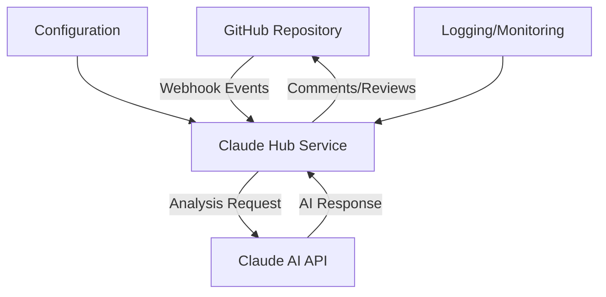

# Claude Hub Project

Claude Hub is Intelligence Assist's flagship project - a sophisticated GitHub webhook service that brings Claude AI directly into your development workflow.

## What is Claude Hub?

Claude Hub acts as an intelligent assistant for your GitHub repositories, providing automated code reviews, issue management, and smart responses to team communications.

## Key Capabilities

### 🔍 Automated PR Reviews
- **Code Quality Analysis** - Identifies potential bugs, security issues, and code smells
- **Performance Optimization** - Suggests improvements for better performance
- **Best Practices** - Ensures adherence to coding standards and conventions
- **Security Scanning** - Detects potential security vulnerabilities

### 🏷️ Intelligent Issue Management  
- **Auto-Tagging** - Automatically categorizes issues by type, priority, and component
- **Duplicate Detection** - Identifies and flags potential duplicate issues
- **Priority Assessment** - Analyzes issue content to suggest appropriate priority levels
- **Component Mapping** - Tags issues with relevant code components

### 💬 Smart Communication
- **Mention Responses** - Responds intelligently when mentioned in comments
- **Context Awareness** - Understands conversation context and repository state
- **Technical Questions** - Answers questions about code, architecture, and implementation
- **Documentation Links** - Provides relevant documentation references

## Architecture Overview

## Integration Benefits

- **Faster Code Reviews** - Reduces manual review time by 60-80%
- **Improved Code Quality** - Catches issues early in the development process
- **Better Issue Management** - Organizes and prioritizes issues automatically
- **Enhanced Team Communication** - Provides instant answers to technical questions
- **Reduced Onboarding Time** - Helps new team members understand codebase faster

## Getting Started

Ready to integrate Claude Hub with your repository?

[→ Installation Guide](../../claude-hub/getting-started/installation)

## Support & Community

- 📖 [Full Documentation](../../claude-hub/overview)
- 🐛 [Report Issues](https://github.com/intelligence-assist/claude-hub/issues)
- 💬 [GitHub Discussions](https://github.com/intelligence-assist/claude-hub/discussions)
- 🆘 [Submit an Issue](https://github.com/intelligence-assist/claude-hub/issues/new)

## Open Source

Claude Hub is open source and welcomes contributions from the community. Check out our GitHub repository to get started with contributing.